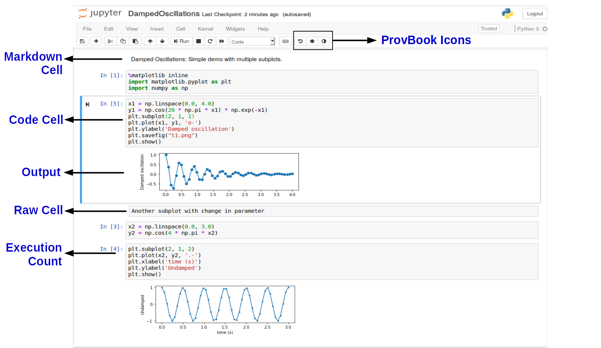
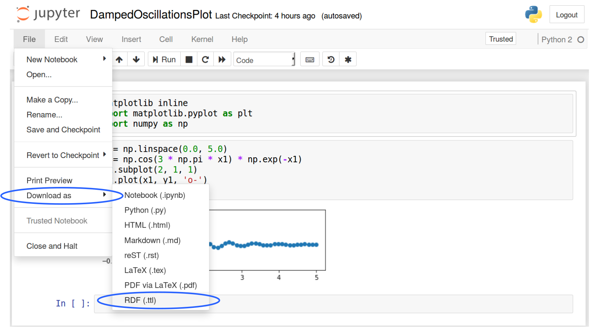
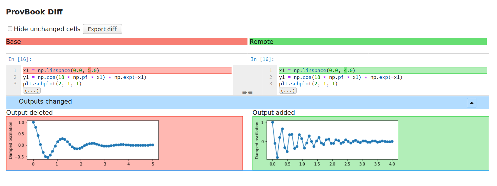

# ProvBook: Provenance of the Notebook.
This is a complete package that captures and displays the provenance of Jupyter Notebook executions, downloads the provenance information in RDF (Resource Description Framework) and displays the provenance difference of several executions of each notebook cell.

ProvBook provides three features:
1. provbook :
  Displays the provenance of a Jupyter Notebook.
2. notebook_rdf :
  Converts Jupyter Notebooks to RDF and the converted RDF back to Jupyter Notebooks.
3. provbookdiff :
   Displays the difference in the provenance of two executions of a Jupyter Notebook code cell along with the input and the output.


Demo
----
A video showing the installation and use of ProvBook with an example is available [here](https://doi.org/10.6084/m9.figshare.6401096).

Publication
-----------
[ProvBook: Provenance-based Semantic Enrichment of Interactive Notebooks for Reproducibility](http://ceur-ws.org/Vol-2180/paper-57.pdf), Sheeba Samuel and Birgitta König-Ries, The 17th International Semantic Web Conference (ISWC) 2018 Demo Track

[A Provenance-based Semantic Approach to Support Understandability, Reproducibility, and Reuse of Scientific Experiments](https://doi.org/10.22032/dbt.40396)

Installation
-------------

Prerequisite: [Jupyter Notebook](https://jupyter.org/)

Install provbook with pip:

```bash
pip install provbook
```

## ProvBook
The module provides the provenance of the execution of cells. It captures and stores the provenance of the execution of the cells over the course of time. Every cell is extended with a provenance area with a slider. The provenance area shows the history of the execution of each code cell. The provenance information of the cell execution includes the start and
end time of each execution, the total time it took to run the code cell, the source code and the output got during that particular execution. It also shows the provenance of text cells where it displays the modified time and the source.

ProvBook icons are added in the toolbar for displaying the provenance of selected or all cells and the provenance difference of executions of cells.



ProvBook also adds a provenance menu in the Jupyter Notebook interface.


A user can toggle the provenance display for a selected cell from Cell -> Provenance -> Toggle visibility (selected).
A user can clear the provenance data from the metadata of the notebook from Cell -> Provenance -> Clear (all).


notebook_rdf
------------
ProvBook provides the user the ability to convert the notebooks into RDF along with the provenance traces and execution environment attributes. This helps to semantically represent the provenance information of notebook execution.
This is a command-line utility which takes a notebook as input and generates the RDF Turtle file. The RDF is generated using the [REPRODUCE-ME ontology](https://w3id.org/reproduceme/research) extended from W3C standard PROV-O and the P-Plan ontology. The RDF generated from the notebook can be converted back to a Jupyter Notebook. The notebook can be downloaded as RDF from the Notebook interface.

### Example usage of notebook_rdf
Convert your notebook to RDF
```bash
notebook_rdf your_notebook.ipynb
```
or
```bash
notebook_rdf --from notebook your_notebook.ipynb --to RDF
```

Convert your RDF to notebook
```bash
notebook_rdf notebook_rdf.ttl
```
or
```bash
notebook_rdf --from RDF notebook_rdf.ttl --to notebook
```
The notebook can also be downloaded as RDF from the File Menu -> Download as -> RDF (.ttl).


ProvBookDiff
------------
This module helps users to compare the results of different executions of a Jupyter Notebook. The user is provided with a dropdown to select two executions based on the starting time of the executions. When the user selects the two executions, the
difference in the input and the output of these executions are shown side by side.

If there are differences in the input or output, the difference is highlighted for the user to distinguish the change.
The users can select the original experimenter’s execution with their own execution of the Jupyter Notebook as well.
The provbookdiff is based on the [nbdime](https://github.com/jupyter/nbdime). It extends the nbdime tool and calls the API from nbdime to see the difference between the provenance of each execution of a notebook code cell.

Internals
-----------
The provenance is stored in the metadata of the notebook. Every time a code cell is executed, a new entry 'provenance' is added to the metadata of the code cell. The start and end time of the execution is added with the time it took to execute. The source and the output obtained from executing the cell is added to the metadata so that it can be shared with other collaborators to verify the output. The ProvBookDiff is based on the nbdime provided by Jupyter Notebook Development team.
