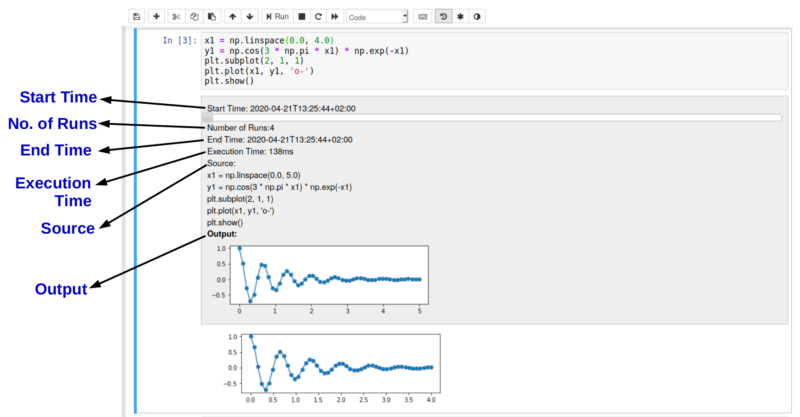
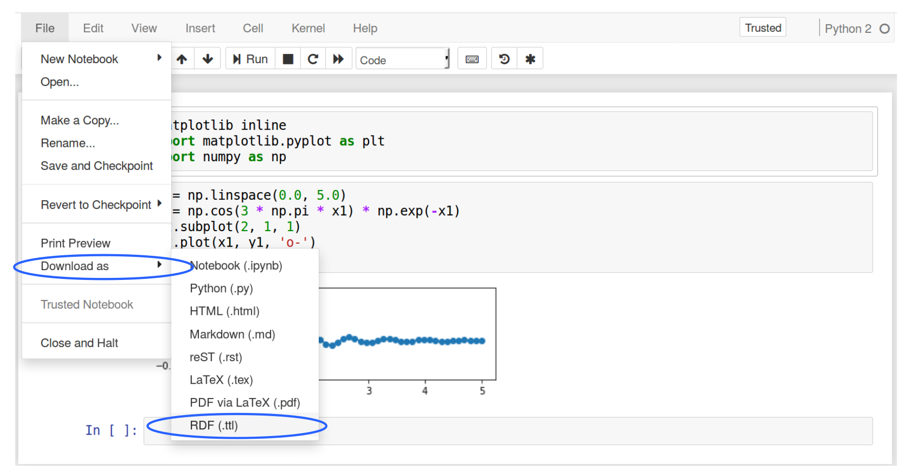

# ProvBook: Provenance of the Notebook.
This is a complete package that captures and displays the provenance of different notebook extensions, downloads the provenance information in RDF and displays the provenance difference of several executions of each notebook cell.
ProvBook provides extensions to capture and display the provenance of each notebook cell. It also shows the difference between the provenance of two executions of a notebook cell.
Every cell is extended with a provenance area with a slider. The provenance area shows the history of the execution of each code cells. As you move the slider, you could see the start and end time of each execution, how long it took to execute, the number of runs, the source, and output of each execution. It also shows the provenance of text cells where it shows the modified time and the source. ProvBook provides three features:
1. provbook :
  Displays the provenance of a Jupyter Notebook.
2. notebook_rdf :
  Convert Jupyter Notebooks to RDF and the converted RDF back to Jupyter Notebooks.
3. provbookdiff :
   Displays the difference in the provenance of two executions of a Jupyter Notebook code cell along with the input and the output.


Demo
----
A video showing the installation and use of ProvBook with an example is available [here](https://doi.org/10.6084/m9.figshare.6401096).

Publication
-----------
[ProvBook: Provenance-based Semantic Enrichment of Interactive Notebooks for Reproducibility](http://ceur-ws.org/Vol-2180/paper-57.pdf), Sheeba Samuel and Birgitta König-Ries, The 17th International Semantic Web Conference (ISWC) 2018 Demo Track

[A Provenance-based Semantic Approach to Support Understandability, Reproducibility, and Reuse of Scientific Experiments](https://doi.org/10.22032/dbt.40396)

Installation
-------------

Prerequisite
[Jupyter Notebook](https://jupyter.org/)

Installation steps of Jupyter Notebook can be found [here](http://jupyter.org/install)

Installation of ProvBook
```bash
sudo pip install ProvBook
```

## ProvBook
The module provides the provenance of the execution of cells. The screenshot shows the toolbar button for displaying the provenance of selected or all cells.


The Provenance Menu.

A user can toggle the provenance display for a selected cell from Cell -> Provenance -> Toggle visibility (selected).
A user can clear the provenance data from the metadata of the notebook from Cell -> Provenance -> Clear (all).



notebook_rdf
------------
This module converts Jupyter Notebooks to RDF and the converted RDF back to Jupyter Notebooks. This is a command-line utility which takes a notebook as input and generates the RDF Turtle file. The RDF is generated using the [REPRODUCE-ME ontology](https://w3id.org/reproduceme/research) extended from W3C standard PROV-O and the P-Plan ontology. The RDF generated from the notebook can be converted back to a Jupyter Notebook. The notebook can be downloaded as RDF from the Notebook interface.

### Example usage of notebook_rdf
Convert your notebook to RDF
```bash
notebook_rdf your_notebook.ipynb
```
or
```bash
notebook_rdf --from notebook your_notebook.ipynb --to RDF
```

Convert your RDF to notebook
```bash
notebook_rdf notebook_rdf.ttl
```
or
```bash
notebook_rdf --from RDF notebook_rdf.ttl --to notebook
```
The notebook can also be downloaded as RDF from the File Menu -> Download as -> RDF (.ttl).


ProvBookDiff
------------
This module displays the difference in the provenance of any two executions of a Jupyter Notebook code cell along with the input and the output.
The provbookdiff is based on the [nbdime](https://github.com/jupyter/nbdime). It extends the nbdime tool and calls the API from nbdime to see the difference between the provenance of each execution of a notebook code cell. The screenshot shows the ProvBookDiff of two different executions to see the difference in the input and the output.


Jupyter version support
------------------------

The extensions work with Jupyter 5.x.


Internals
-----------
The provenance is stored in the metadata of the notebook. Every time a code cell is executed, a new entry 'provenance' is added to the metadata of the code cell. The start and end time of the execution is added with the time it took to execute. The source and the output obtained from executing the cell is added to the metadata so that it can be shared with other collaborators to verify the output. The ProvBookDiff is based on the nbdime provided by Jupyter Notebook Development team.
